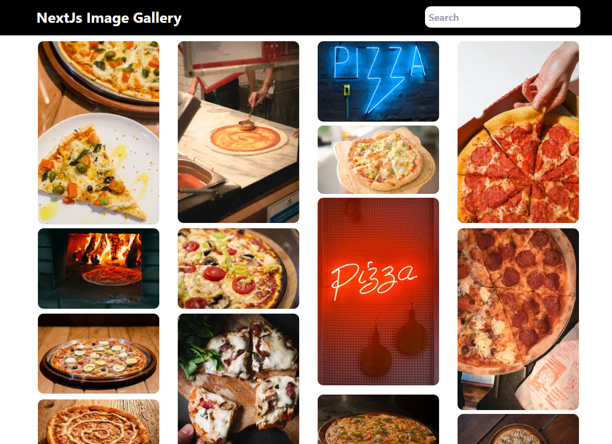
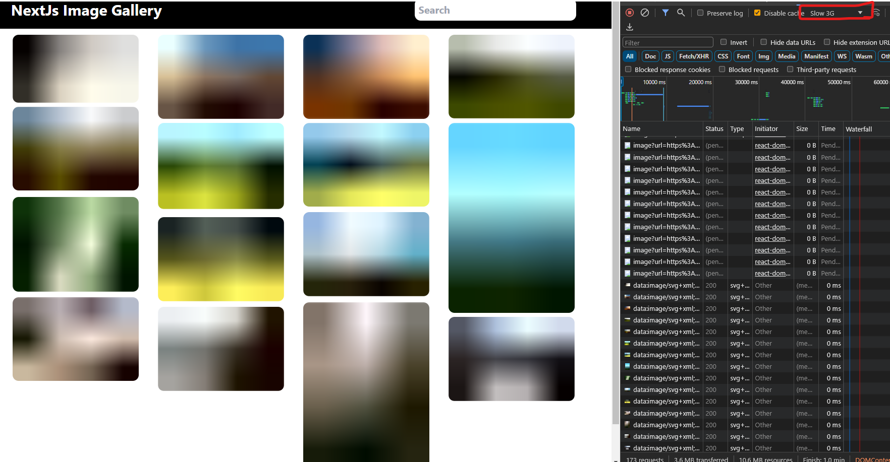

# Image Optimization with Next.js Image Component

## Live Demo

Explore the live demo showcasing image optimization using the Next.js Image component: [Image Optimization Demo](#)

## Overview

### Project Insight: 📚

This documentation outlines the features and implementation details for optimizing images using the Next.js Image optimizations. The primary focus is on ensuring responsive, visually appealing images while maintaining performance.

## Features

### 1. Envalid Library Integration

- Safely type `.env` variables using the `envalid` library to enhance security and maintainability.

### 2. Personalized Aspect Ratio for Each Image

- Achieve a personalized aspect ratio for images based on their original width and height, ensuring a visually consistent display.

  

  Test image blurring preview, even with slow 3G connection, providing a nice preview of background images blurred:

  

### 3. External API (Pexels) Integration

- Integrate the Pexels API seamlessly by adding it to the `remotePatterns` in the `next.config.js` file.

  ```javascript
  const nextConfig = {
    images: {
      remotePatterns: [
        {
          protocol: "https",
          hostname: "images.pexels.com",
          port: "",
          pathname: "/photos/**",
        },
      ],
    },
  };

  module.exports = nextConfig;
  ```

### 4. Proper Scaling with `object-fit: contain`

- Apply `object-fit: contain;` to images for proper scaling within their parent containers, ensuring an aesthetically pleasing layout.

### 5. Dynamic Image Sizing with `sizes` Property

- Utilize the `sizes` attribute along with tools like [respimagelint](https://ausi.github.io/respimagelint/) to automatically calculate optimal image sizes for different devices.

### 6. Blurring Effect for Dynamic Images

- Implement a blurring effect for dynamic images using the `blurDataURL` property. Tools like Plaiceholder can assist in generating base64 image data.

  - Schema property for blurred effect:

    ```javascript
    blurredDataUrl: z.string().optional(),
    ```

    Learn more: [Next.js Image Component - Placeholder Property](https://nextjs.org/docs/pages/api-reference/components/image#placeholder)

### 7. Calculating Width and Height Ratios

- Calculate image dimensions based on specific width and height values, ensuring accurate display and layout.

  ```javascript
  const widthHeightRatio = photo.height / photo.width;
  const galleryHeight = Math.ceil(250 * widthHeightRatio);
  const photoSpans = Math.ceil(galleryHeight / 10) + 1;
  ```

## Status

### Upcoming Enhancements

- netlify hosting ...

## 📚 References

- 🔗 [Next.js Official Site](https://nextjs.org/)
- 🔗 [Pexels API Documentation](https://www.pexels.com/api/)
- 🔗 [Tailwind CSS Official Site](https://tailwindcss.com/)
- 🔗 [TypeScript Official Site](https://www.typescriptlang.org/)
- 🔗 [Zod Official Site](https://zod.dev/)
- 🔗 [Plaiceholder Documentation](https://plaiceholder.co/docs)
- 🔗 [Envalid Package](https://www.npmjs.com/package/envalid)

Feel free to explore the live demo and refer to the provided references for more information on the technologies used in this project.
